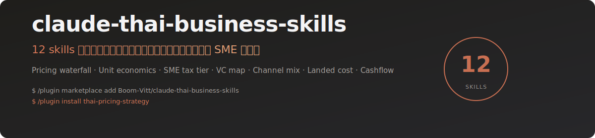

<div align="center">



<br/>

[](LICENSE)
[](https://docs.claude.com/en/docs/claude-code)
[](#skills--ตัวที่มี)
[](https://github.com/Boom-Vitt/claude-thai-business-skills/actions/workflows/test.yml)

</div>

> Claude เก่งกรอบที่ปรึกษาฝรั่งอยู่แล้ว — Porter, BCG, Lean Canvas, SaaS metrics. แต่พอลูกค้าเป็น SME ไทยที่ผมจดทะเบียนเป็น "หจก." มีพี่สาวเซ็นค้ำ ฝากของขาย Shopee Mall ผ่อนเครื่องจักรกับลีสซิ่ง 36 เดือน — Claude ก็ใส่ตัวเลขมั่วเหมือนเด็กฝึกงาน MBA ปีแรก.
>
> รีโปนี้คือ 12 skills ที่ผมเขียนไว้ใช้กับลูกค้า SME ไทยจริง — ติดตั้งครั้งเดียว Claude หยิบใช้เองอัตโนมัติเวลาเจอ task ที่ปรึกษาธุรกิจในบริบทไทย.

---

## ติดตั้ง / Install

```bash
# วิธีที่แนะนำ — ผ่าน Claude Code plugin marketplace
/plugin marketplace add Boom-Vitt/claude-thai-business-skills
/plugin install claude-thai-business-skills    # ทั้งชุด 12 ตัว
/plugin install thai-pricing-strategy          # หรือเฉพาะตัวที่ต้องการ
```

แต่ละ skill ลงทะเบียนเป็น plugin แยกใน marketplace ด้วย — ติดตั้งทีละตัวได้เลย ไม่ต้องเอามาทั้งชุด. ดูครบทุก skill พร้อมคำสั่งติดตั้งทีละตัวที่ [SKILLS.md](SKILLS.md).

<details>
<summary><b>วิธีอื่น</b> — clone + script, หรือ copy เฉพาะตัว</summary>

```bash
# Clone แล้วรันสคริปต์ติดตั้งทุกตัว
git clone https://github.com/Boom-Vitt/claude-thai-business-skills.git
cd claude-thai-business-skills
./install.sh                          # ทุก skill
./install.sh thai-unit-economics      # เฉพาะที่ต้องการ

# หรือ copy เฉพาะตัวที่ต้องใช้
cp -r skills/thai-pricing-strategy ~/.claude/skills/
```

</details>

หลังติดตั้ง: เปิด session ใหม่ ลองพิมพ์เคสที่ปรึกษาเป็นภาษาไทยตามด้านล่าง Claude จะหยิบ skill ที่เหมาะสมเอง.

---

## เรื่องมีอยู่ว่า / Why this exists

ผมเป็นที่ปรึกษาให้ SME ไทยมาหลายปี. ลูกค้าทั่วไป: เถ้าแก่อายุ 40-55, รายได้ปีละ 5-50 ล้าน, มีพี่น้อง/ลูกค้าเซ็นค้ำในงบ, ไม่มี CFO มี "บัญชีพี่ตุ๊ก" เป็น outsource. พอผมให้ Claude ช่วยร่าง financial model หรือ go-to-market — มันเอา template SaaS ฝรั่งมาวาง แล้วได้คำตอบที่ผิดในจุดที่ Thai-specific เกือบทุกครั้ง.

ผมเลยจดรายการสิ่งที่ Claude พลาดซ้ำๆ ตอนทำงานที่ปรึกษาบริบทไทย:

1. ทำ Business Model Canvas เหมือน SaaS Silicon Valley — ไม่มีช่องสำหรับ "พี่สาวค้ำ", "เครื่องผ่อน 36 เดือน", หรือ family-business stakeholder map
2. TAM/SAM/SOM ตัวเลขมั่วจาก Statista global — ไม่ดึง NSO household survey, BOT statistics, DBD financial filings ที่เปิด public ฟรี
3. Porter 5 Forces เขียนเป็น consultancy-speak อ่านไม่รู้เรื่อง — ทั้งที่ DBD เปิดให้ดูงบบริษัทคู่แข่ง (ทุกบริษัทจำกัดต้องยื่นทุกปี) ได้ที่ datawarehouse.dbd.go.th
4. ตั้งราคา "ต้นทุน × 2.5 = ราคาขาย" โดยลืม Shopee Mall fee (5-8%), Lazada Mall (5-7%), TikTok Shop (1-8% ตามหมวด), payment gateway (3-4%), packaging, freight — มาร์จิ้นจริงเหลือ 8% ไม่ใช่ 60%
5. CAC/LTV ใช้ benchmark SaaS US — ทั้งที่ Thai market CPM Meta, TikTok, LINE OA push, KOC vs nano vs mid-tier KOL ราคา 2026 จาก Tellscore/AnyMind ต่างกันเป็น 10 เท่า
6. 3-year P&L ใช้ corporate tax 20% หมด — ทั้งที่ SME ไทย (ทุนชำระ ≤5M, รายได้ ≤30M) เสีย 0% ที่ <300k, 15% ที่ 300k-3M, แล้วค่อย 20% — ผิดทุกบรรทัด
7. แนะนำให้ "จดบริษัทเลย" ทั้งที่ลูกค้าควรอยู่ทะเบียนพาณิชย์ (sole prop) จนถึง 1.8M ปีค่อยเข้า VAT — ประหยัดค่าทำบัญชี 60k/ปี
8. Pitch deck copy YC template — ทั้งที่ VC ไทย (500 Global, AddVentures, Beacon VC, Krungsri Finnovate, SCB10X, KX, InnoSpace) มี check size, stage, thesis ของตัวเองที่ไม่เหมือน US เลย
9. แนะนำ "ขึ้น Shopee เลย" หรือ "build website เอง" — โดยไม่คำนวน channel economics ของ AOV/repeat rate ที่ต่างกัน LINE OA / FB Shop / Shopee Mall / TikTok Shop
10. ดีลกับ KOL ใช้ flat fee + commission แบบฝรั่ง — ลืมว่า talent fee > 1,000฿ ต้อง WHT 3% (ไทย) / 5% (ต่างชาติ residence) / 15% (non-resident), affiliate revenue share เป็นคนละ category
11. นำเข้าจาก 1688/Alibaba คำนวน landed cost แบบ "ราคา × อัตราแลกเปลี่ยน" — ลืม import duty ตาม HS code, VAT 7% on CIF, FDA cosmetic/food (1-6 เดือน), TISI electronics
12. 90-day cashflow ลืม timing ไทย: credit term 30/60/90 มาตรฐาน, VAT refund delay 3-6 เดือน, payroll PND.1 ทุกวันที่ 7, SSO วันที่ 15, ภงด.50/51 — SME เจ๊งเพราะ timing ก่อนตัวเลข

รายการมัน 12 ข้อพอดี — ผมเลยเขียน 12 skills. ใช้กับลูกค้าทุกคน maintain ทุกอาทิตย์. รีโปนี้คือผลลัพธ์.

---

## Skills — ตัวที่มี

> [!TIP]
> ตัวที่ผมใช้บ่อยสุดคือ `thai-pricing-strategy` กับ `thai-unit-economics` — ลองเริ่มจากสองตัวนี้ก่อน

### 🧭 กลยุทธ์ & การวิเคราะห์ตลาด

- ⭐ **[thai-sme-canvas](skills/thai-sme-canvas)** — Business Model Canvas แบบ SME ไทย: family-stakeholder map, ทุนจดทะเบียน vs ทุนชำระ, MOU vs registered partner, informal employee block
- **[thai-market-sizing](skills/thai-market-sizing)** — TAM/SAM/SOM ที่ดึงตัวเลขจริงจาก NSO, BOT, DBD, ETDA, NESDC, Statista TH — มี source pointer ไม่มั่ว
- **[thai-competitor-scan](skills/thai-competitor-scan)** — Porter 5 Forces แบบใช้งานได้จริง + วิธีดึงงบคู่แข่งจาก datawarehouse.dbd.go.th (public free)

### 💰 ตั้งราคา & หน่วยเศรษฐกิจ

- ⭐ **[thai-pricing-strategy](skills/thai-pricing-strategy)** — ตั้งราคาแบบ waterfall: ต้นทุน → ช่องทาง → fee → packaging → freight → margin. `pricing.py` คำนวน margin จริงต่อช่อง (Shopee/Lazada/Line Shop/TikTok Shop/หน้าร้าน)
- ⭐ **[thai-unit-economics](skills/thai-unit-economics)** — CAC/LTV/payback ด้วย benchmark Thai 2026: Meta CPM, TikTok CPM, LINE OA push, KOC/nano/mid-tier KOL fees (Tellscore, AnyMind, MEDIA Z)
- **[thai-financial-projection](skills/thai-financial-projection)** — 3-yr P&L + cashflow ที่ถูก: SME tax tier (0/15/20%), VAT cycle, SSO 5%+5%, ภงด.50/51 timing. `tax.py` คำนวนถูกตามขนาด

### 📜 จดทะเบียน & ระดมทุน

- **[thai-business-registration](skills/thai-business-registration)** — decision tree: ทะเบียนพาณิชย์ vs หจก. vs บริษัทจำกัด vs BOI — เมื่อไหร่ trigger VAT (1.8M฿), SSO (พนักงาน 1 คน), บัญชีตรวจสอบ
- **[thai-vc-fundraising](skills/thai-vc-fundraising)** — แผนระดมทุนจาก Thai VC จริง: 500 Global, AddVentures, Beacon VC, Krungsri Finnovate, SCB10X, KX, Bualuang Ventures, InnoSpace — stage, check size, thesis ปี 2026

### 🚀 Go-to-Market & ดำเนินงาน

- **[thai-channel-strategy](skills/thai-channel-strategy)** — channel mix matrix ตาม AOV/repeat: LINE OA / FB Shop / Shopee Mall / Lazada / TikTok Shop / offline — ไม่ใช่ "ขึ้น Shopee เลย"
- **[thai-influencer-deal](skills/thai-influencer-deal)** — โครงสร้างดีล KOL ที่ถูกกฎหมาย: WHT 3/5/15%, talent fee vs affiliate share, contract template. `commission.py` คำนวน net payout
- **[thai-sourcing-landed-cost](skills/thai-sourcing-landed-cost)** — นำเข้า 1688/Alibaba landed cost จริง: import duty ตาม HS, VAT on CIF, FDA/TISI/มอก. flag. `landed_cost.py` กับ HS code lookup 2026

### 💧 Cash Survival

- ⭐ **[thai-cashflow-survival](skills/thai-cashflow-survival)** — 90-day cashflow calendar ที่ lock timing ไทย: credit-term 30/60/90, VAT refund 3-6 เดือน, PND.1 (7), SSO (15), ภงด.50/51. `cashflow.py` กางปฏิทินจริง

`⭐` = ตัวที่ผมใช้บ่อยที่สุด.

---

## ลองดู / Try it

หลังติดตั้งเสร็จ เปิด Claude Code แล้วพิมพ์อะไรพวกนี้ดู:

```
ตั้งราคาขายครีมหน้าใส ต้นทุน 85 บาท จะขายที่ Shopee Mall กับหน้าร้าน
ให้ได้ margin 35% หลังหัก fee — คิดราคาให้ที

คำนวน CAC ของแบรนด์เครื่องสำอางที่ใช้ KOC nano ระดับ 5k-50k followers
ฟอลโล่ ค่าตัวเฉลี่ย 1,200 บาท + ส่งของ — net new customer 12 คน/แคมเปญ

ทำ Business Model Canvas ให้ร้านกาแฟทองหล่อ ทุน 2.5M
พี่ชายค้ำเงินกู้แบงค์ 800k — ใส่ family-stakeholder ด้วย

จดบริษัทดีไหม รายได้ปีนี้จะแตะ 1.6M
ยังไม่จ้างใคร ทำคนเดียว ออกใบเสร็จได้ไหมถ้าเป็น sole prop

นำเข้าหูฟัง bluetooth จาก 1688 ราคา 180 หยวน/ชิ้น
landed cost ต่อชิ้นเท่าไหร่ ขึ้น TISI ไหม

ทำ 90-day cashflow ร้านอาหาร revenue 600k/เดือน
จ่ายเงินเดือน 8 คน รวม 180k, ค่าเช่า 95k, ต้นทุนวัตถุดิบ 35%
```

Claude หาเอง — คุณพิมพ์เคสปกติ มันจะรู้ว่าจะหยิบ skill ไหน. ถ้ามันหยิบผิด เปิด issue บอกได้.

---

## โครงสร้างไฟล์

```
claude-thai-business-skills/
├── .claude-plugin/
│   ├── plugin.json          # Plugin metadata
│   └── marketplace.json     # Marketplace listing (per-skill + bundle)
├── .github/
│   ├── workflows/test.yml   # CI: รัน scripts/test-all.sh ทุก push/PR
│   ├── ISSUE_TEMPLATE/      # bug / data correction / new-skill templates
│   └── PULL_REQUEST_TEMPLATE.md
├── assets/banner.svg
├── scripts/
│   ├── test-all.sh          # รัน self-test ทุก skill ในคำสั่งเดียว
│   └── validate-skills.py   # ตรวจ frontmatter ของ SKILL.md ทุกตัว
├── skills/
│   ├── thai-pricing-strategy/
│   │   ├── SKILL.md
│   │   ├── pricing.py       # ← waterfall calc per channel
│   │   └── benchmarks.md    # 2026 marketplace fees, gateway rates
│   ├── thai-unit-economics/
│   │   ├── SKILL.md
│   │   ├── unit_econ.py     # CAC/LTV/payback with TH benchmarks
│   │   └── benchmarks.md
│   └── ... (12 skills total)
├── template/SKILL.md        # scaffold สำหรับสร้าง skill ใหม่
├── docs/
│   ├── sources.md           # แหล่งข้อมูลทางการ (NSO, BOT, DBD, RD, BOI...)
│   ├── my-setup-th.md       # ทัวร์ config ส่วนตัว (sanitized)
│   └── consulting-style.md  # คู่มือสไตล์ที่ปรึกษาที่รีโปนี้ยึด
├── install.sh
├── AGENTS.md                # คู่มือสำหรับ AI agent
├── CONTRIBUTING.md          # ขั้นตอน contribute, ตั้งค่า, test
├── SECURITY.md              # รายงานช่องโหว่ + disclaimer
├── CHANGELOG.md             # Keep a Changelog
├── THIRD_PARTY_NOTICES.md   # เครดิตแหล่งอ้างอิงทางการ
├── LICENSE                  # MIT
└── README.md
```

---

## คุณภาพ / Quality

| Tier | Skills | สถานะ |
|---|---|---|
| **Validator (มี code + tests)** | `thai-pricing-strategy`, `thai-unit-economics`, `thai-financial-projection`, `thai-influencer-deal`, `thai-sourcing-landed-cost`, `thai-cashflow-survival` | Python self-test, Decimal-based; ผ่าน CI |
| **Reference / Decision Tree** | `thai-business-registration`, `thai-sme-canvas`, `thai-channel-strategy` | v0.1 — มีโครง decision tree, ตัวอย่าง 2-3 เคส |
| **Prose / Framework** | `thai-market-sizing`, `thai-competitor-scan`, `thai-vc-fundraising` | v0.1 — ครบเนื้อหาและ source pointer ยังไม่ผ่าน adversarial testing |

รัน self-test ทุกตัวพร้อม validator ที่ตรวจ `SKILL.md` ของทั้ง 12 skill ในคำสั่งเดียว:

```bash
./scripts/test-all.sh
```

ทุก commit ที่ push ไปยัง `main` และทุก pull request จะรันคำสั่งเดียวกันนี้ผ่าน GitHub Actions โดยอัตโนมัติ — ดู workflow ที่ [.github/workflows/test.yml](.github/workflows/test.yml). รายละเอียดวิธี register self-test ของ skill ใหม่ใน CI อยู่ใน [CONTRIBUTING.md](CONTRIBUTING.md).

> [!NOTE]
> ตัวอย่างเคสในรีโปนี้ (ชื่อบริษัท, ตัวเลข, ลูกค้า) เป็น **synthetic fixtures** — ไม่ใช่ลูกค้าจริง. อัตราภาษี/ค่าธรรมเนียมตลาดอ้างอิงปี 2026 — เปลี่ยนได้, เปิด PR ถ้ามีอัปเดต

---

## ข้อจำกัดที่รู้ตัวดี / Known limitations

ผมเขียนรีโปนี้คนเดียว ระหว่างทำงานให้ลูกค้า. ใช้เองทุกอาทิตย์ก็จริง แต่มีจุดอ่อน:

- **กฎหมายภาษีเปลี่ยน** — `thai-financial-projection` กับ `thai-business-registration` ใช้อัตรา 2026 (corporate tax SME tier, VAT 7%, SSO 5%+5%, WHT). รัฐบาลขยับเมื่อไหร่ ต้องอัปเดต. เปิด issue ถ้าเจอ
- **DBD public lookup เปลี่ยน UI บ่อย** — `thai-competitor-scan` อ้าง datawarehouse.dbd.go.th — flow อาจล้าสมัยทุก 6-12 เดือน
- **Marketplace fee ตลาดเปลี่ยนทุกไตรมาส** — Shopee Mall, Lazada Mall, TikTok Shop ปรับ commission rate / shipping subsidy บ่อย. `pricing.py` มี config block ที่แก้ง่าย
- **VC landscape ขยับ** — `thai-vc-fundraising` ใช้ data ปี 2026. กองทุนปิด/เปิดใหม่/เปลี่ยน thesis เปิด PR
- **ไม่ใช่ที่ปรึกษากฎหมาย/ภาษีของจริง** — เคสซับซ้อน (BOI, ส่งออกกลับ, transfer pricing) ต้องคุยทนาย/ผู้สอบบัญชี — รีโปนี้ช่วย first-cut เท่านั้น

---

## ที่มาของ "remix" / Credits & inspirations

รีโปนี้ remix แนวคิดจากของดีๆ ในชุมชน Claude/AI agents — เครดิตและ references:

- [**claude-thai-skills**](https://github.com/Boom-Vitt/claude-thai-skills) — ผมเป็นคนเขียน, เอา layout, marketplace pattern, CI structure มาเทียบ
- [**anthropics/financial-services**](https://github.com/anthropics/financial-services) — reference agents สำหรับการเงิน, ปรับมาให้เหมาะกับ SME ไทย
- [**alirezarezvani/claude-skills**](https://github.com/alirezarezvani/claude-skills) — 263+ skill ครอบคลุม C-level advisory, financial modeling — เอา skill-design philosophy มาประยุกต์
- [**phuryn/pm-skills**](https://github.com/phuryn/pm-skills) — Porter 5 Forces, SWOT, Lean Canvas — refactor ให้พูดภาษา SME ไทย
- [**deanpeters/Product-Manager-Skills**](https://github.com/deanpeters/Product-Manager-Skills) — Ansoff, BCG, Blue Ocean — เก็บโครง บีบให้สั้น, ใส่บริบทไทย
- [**maigentic/stratarts**](https://github.com/maigentic/stratarts) — 27 business strategy skills — เอา chaining pattern มาคิด
- [**VoltAgent/awesome-agent-skills**](https://github.com/VoltAgent/awesome-agent-skills) — แหล่งหา skill ดีๆ มาดูเทคนิคการเขียน frontmatter
- [**jezweb/claude-skills**](https://github.com/jezweb/claude-skills) — strategy-document patterns

ทุกตัวข้างบนเขียนได้ดี — รีโปนี้ไม่ได้แข่ง, แต่เติมช่องที่ขาด: **บริบท SME ไทย ที่ตัวเลข/กฎหมาย/พฤติกรรมตลาดต่างจาก US/Global**. ถ้าทำงานบริษัทใหญ่หรือ SaaS global ใช้ของ alirezarezvani / phuryn ดีกว่า.

---

## License

MIT — ดู [LICENSE](LICENSE).

เนื้อหากฎหมาย/ภาษีในรีโปนี้ **ไม่ใช่คำปรึกษากฎหมาย** — เป็น first-cut consulting framework สำหรับ ที่ปรึกษา/founder เอาไปใช้คุยกับลูกค้า/ทนาย/ผู้สอบบัญชีของตัวเอง. ใช้แล้วเสียหายไม่รับผิดชอบ. ดู [SECURITY.md](SECURITY.md) สำหรับ disclaimer เต็ม.

---

<div align="center">

เขียนโดย [Vittawat (boombignose)](https://github.com/Boom-Vitt) — ที่ปรึกษา SME ไทย, กรุงเทพฯ

</div>
